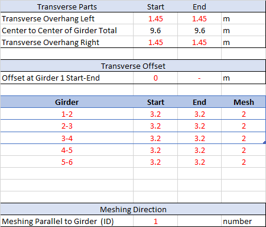
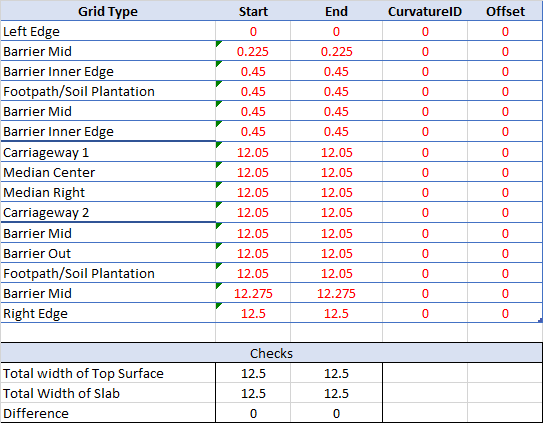
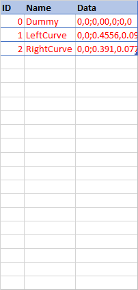

# Geometry

### Terminology

As per image above, grillage model are divided into 4 sides(Start-End,Left-Right) as per traffic direction.

for direction, Origin is Set at B point. ==Axis are set as per AutoCAD Default Axis system==. X increases from start to end of grillage and Y increases in right to left direction.

for Girder and Diapharms are reffered using its number. for example girder between point B and C is Girder 1, Diaphram between point D and I is Diapham 3.

!!!tip
    All Inputs and direction or terminology are choosen such a way that it remains absolute.This direction or Input units will not change with if you move or rotate grillage.

### Longitudinal Grid

### Transverse Grid

### Topsurface Grid

