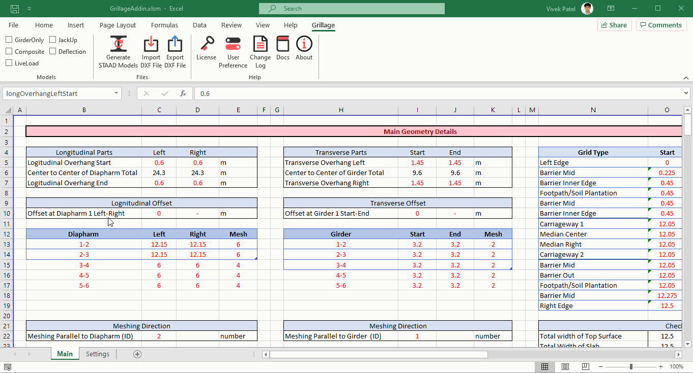
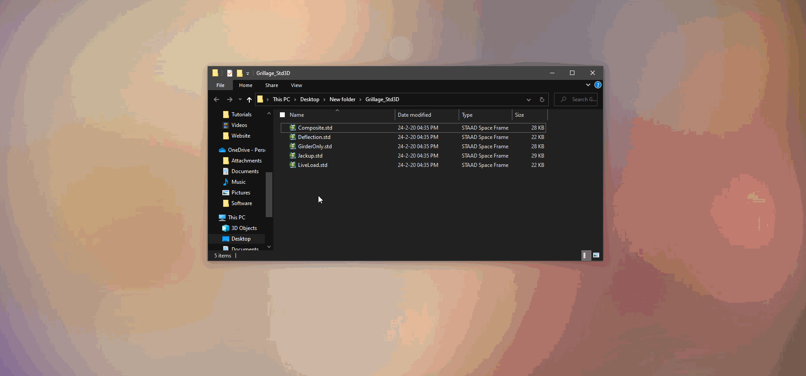

# STAAD Grillage Add-in

### Overview

It is Excel Add-in to Generate STAAD Grillage Model.

STAAD Grillage Add-in can Generate STAAD Grillage Model as per User Input for any geometry or size. Program uses Excel As input Sheet so user can Easily modify formula or change cell links. User has Complete Control over Geometry, Meshing,Section, Supports, Loading, as well as Nodes for Results Extraction.

### **Features**

- Generate Grillage of Any Size, any number of Main or Cross Girder
- Generate Grillage in Curvature with or without skew
- User Define Meshing and Nodes
- Automatic Property & Load Assignment
- Moving Load Generation
- Load Combination Generation
- Generate Multiple Model (Girder only, Composite, Live Load, Jack Up) in Single Click

### Demo

