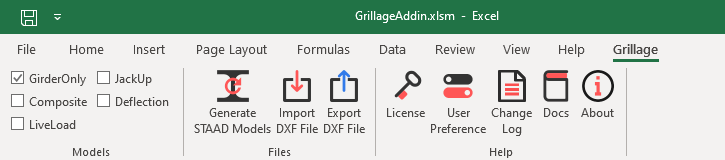
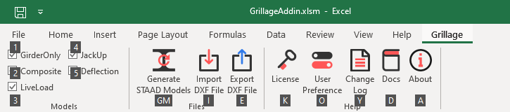

# Ribbon Tab

### Grillage Tab

- Grillage Tab Automatically Activated when user will open Grillage Add-in Excel Sheet.

- This tab won’t be activated with any other excel sheet.

- User can use `ALT+G` keyboard shortcut to Access this tab.

- To use Specific command for example to see Changelog use `ALT+G+K`

  

### Models

This group includes checkbox for each model to be generated. program will only generate model if it is selected in models groups.

- GirderOnly : Model with Girder only properties for main girder with all Dead loads.
- Composite : This model is same as GirderOnly Model. Only Change is that main girder include composite property.
- LiveLoad : This model is same as Composite model with moving loads. Dead loads are not included.
- JackUp : This model is Also Copy of Composite Model only Change is Support Locations.
- Deflection : Composite model with Elasticity modified for deflection check.

### Files

#### Generate STAAD Models 

-  Functions :
	- Generate STAAD Model for Selected Model
	- Option to Enable/Disable Loads for Each Model
	- Option to Modify Load Combination for Each Model
- Default Unit : Ton,Meter
- Keyboard Shortcut : `ALT+G+G+M`

#### Import DXF File

- Functions : 
	- Extract Curvature points from AutoCAD DXF File
	- Option to Extract Curvature Points from Specific Layer
	- Option to Extract Curvature from Multiple Drawings.
- Default Unit : mm
- Keyboard Shortcut : `ALT+G+I`

#### Export DXF File

- Functions : 
	- Export Grillage Geometry to AutoCAD DXF File.
- Default Unit : mm
- Keyboard Shortcut : `ALT+G+E`

### Help

#### License

- Functions : 
	- Activate License Key for Add-in
- Keyboard Shortcut : `ALT+G+K`

#### User Preference

- Functions : 
	- Settings for Grillage Add-in
	- This setting will affect all Excel Sheets
	- Document Customization Option to Link or Unlink Add-in with Excel Sheet
- Keyboard Shortcut : `ALT+G+O`

#### Changelog

- Functions : 
	- Show Changes, Fix or Added Features with each version of Add-in
	- Also Shows Upcoming Changes or Features
- Keyboard Shortcut : `ALT+G+Y`

#### Docs

- Functions : 
	- Online Documentation for Project
- Keyboard Shortcut : `ALT+G+D`

#### About

- Functions : 
	- Shows Add-in Product Name and Version Info
	- Include Contact Info and Copywrite Details
- Keyboard Shortcut : `ALT+G+A`